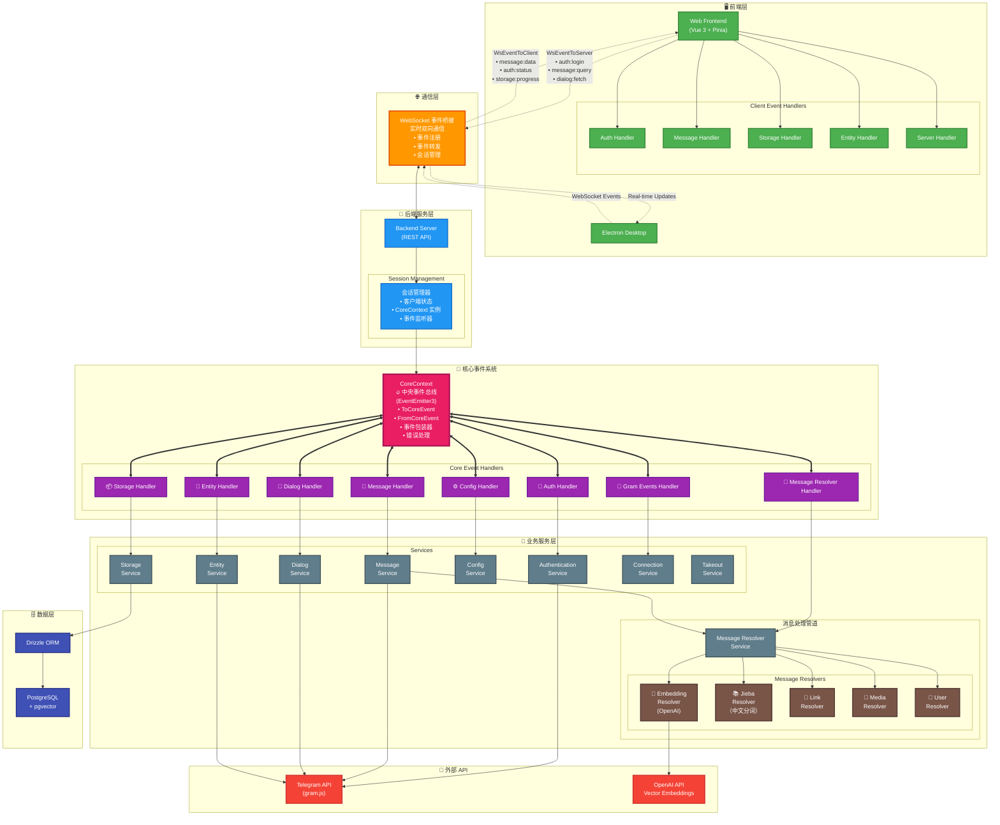

<h1 align="center">Telegram Search</h1>

<center>
  <a href="https://trendshift.io/repositories/13868" target="_blank"></a>
</center>

<p align="center">
  [<a href="https://discord.gg/NzYsmJSgCT">Join Discord Server</a>] [<a href="../README.md">English</a>] [<a href="./README_JA.md">日本語</a>]
</p>

<p align="center">
  <a href="https://deepwiki.com/GramSearch/telegram-search"></a>
  <a href="https://github.com/GramSearch/telegram-search/blob/main/LICENSE"></a>
    <a href="https://discord.gg/NzYsmJSgCT"></a>
  <a href="https://t.me/+Gs3SH2qAPeFhYmU9"></a>
</p>

> 唯一官方网站为 `intentchat.app`，其他网站均为诈骗。
>
> 我们未发行任何虚拟货币，请勿上当受骗。
>
> 本软件仅可导出您自己的聊天记录以便搜索，请勿用于非法用途。

一个功能强大的 Telegram 聊天记录搜索工具，支持向量搜索和语义匹配。基于 OpenAI 的语义向量技术，让你的 Telegram 消息检索更智能、更精准。

## 💖 赞助者


## 🚀 快速开始

1. 克隆仓库

```bash
git clone https://github.com/GramSearch/telegram-search.git
cd telegram-search

# 切换到 release 分支
git switch release
```

2. 修改配置文件

```bash
# 根据需要，修改 `config/config.yaml` 中的设置
# 务必修改配置中的 `database.host` 的值为数据库容器的服务名称 "pgvector"

cp config/config.example.yaml config/config.yaml
```

3. 启动服务

```bash
docker compose up -d
```

访问 `http://localhost:3333` 即可打开搜索界面。

## 💻 开发教程

1. 克隆仓库

2. 安装依赖

```bash
pnpm install
```

3. 修改配置文件

4. 启动数据库容器：

```bash
# 在本地开发模式下， Docker 只用来启动数据库容器
docker compose up -d pgvector
```

5. 同步数据库表结构：

```bash
pnpm run db:migrate
```

6. 启动服务：

```bash
# 启动后端服务
pnpm run dev:server

# 启动前端界面
pnpm run dev:frontend
```

## 🏗️ 系统架构



### 事件驱动架构概述

- **🎯 CoreContext - 中央事件总线**：系统核心，使用 EventEmitter3 管理所有事件
  - **ToCoreEvent**：发送到核心系统的事件（如 auth:login, message:query 等）
  - **FromCoreEvent**：从核心系统发出的事件（如 message:data, auth:status 等）
  - **事件包装器**：为所有事件提供自动错误处理和日志记录
  - **会话管理**：每个客户端会话都有独立的 CoreContext 实例

- **🌐 WebSocket 事件桥接**：实时双向通信层
  - **事件注册**：客户端注册想要接收的特定事件
  - **事件转发**：在前端和 CoreContext 之间无缝转发事件
  - **会话持久化**：跨连接维护客户端状态和事件监听器

- **🔄 消息处理管道**：通过多个解析器进行基于流的消息处理
  - **Embedding 解析器**：使用 OpenAI 生成向量嵌入，用于语义搜索
  - **Jieba 解析器**：中文分词，提升搜索能力
  - **链接/媒体/用户解析器**：提取和处理各种消息内容类型

- **📡 事件流程**：
  1. 前端通过 WebSocket 发送事件（如 `auth:login`, `message:query`）
  2. 服务器将事件转发到相应的 CoreContext 实例
  3. 事件处理器处理事件并调用相应的服务
  4. 服务通过 CoreContext 发出结果事件
  5. WebSocket 将事件转发到前端进行实时更新

## 🚀 Activity

[](https://star-history.com/#luoling8192/telegram-search&Date)
