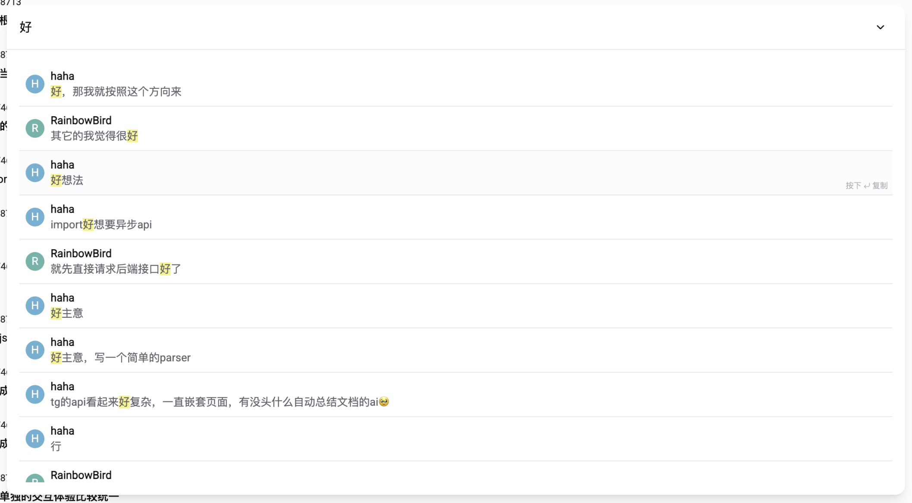
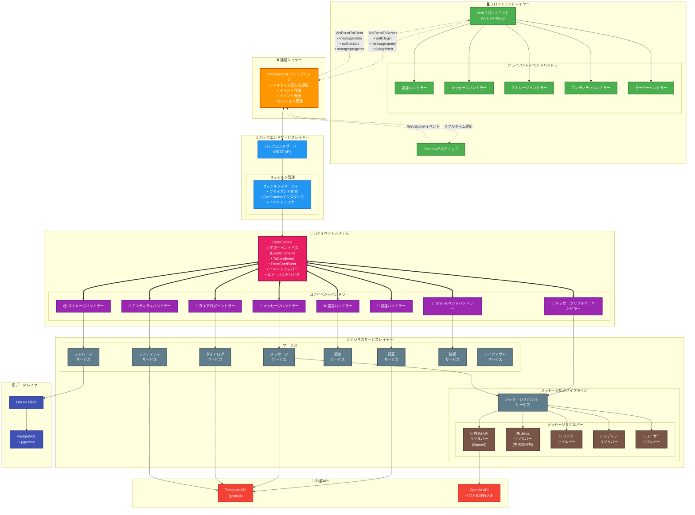

<h1 align="center">Telegram Search</h1>

<p align="center">
  <a href="https://trendshift.io/repositories/13868" target="_blank"></a>
</p>

<p align="center">
  [<a href="https://tgsearch.netlify.app">すぐに使用</a>] [<a href="https://discord.gg/NzYsmJSgCT">Discordサーバーに参加</a>] [<a href="../README.md">English</a>] [<a href="./README_CN.md">简体中文</a>]
</p>

<p align="center">
  <a href="https://app.netlify.com/projects/tgsearch/deploys"></a>
  <a href="https://deepwiki.com/GramSearch/telegram-search"></a>
  <a href="https://github.com/GramSearch/telegram-search/blob/main/LICENSE"></a>
    <a href="https://discord.gg/NzYsmJSgCT"></a>
  <a href="https://t.me/+Gs3SH2qAPeFhYmU9"></a>
</p>

> 公式ウェブサイトは `intentchat.app` のみです。他のウェブサイトはすべて詐欺です。
>
> 仮想通貨は一切発行していません。詐欺にご注意ください。
>
> このソフトウェアは自分のチャット履歴をエクスポートして検索するためのものです。違法な目的で使用しないでください。

ベクトル検索とセマンティックマッチングをサポートする強力なTelegramチャット履歴検索ツール。OpenAIのセマンティックベクトル技術に基づいて、Telegramメッセージの検索をよりスマートで正確にします。

## 💖 スポンサー


## 🌐 すぐに使用

我々はオンラインバージョンを提供しており、Telegram Searchのすべての機能を体験できます。以下のURLから開始してください:
> 我々はあなたのプライバシーを尊重します。

https://tgsearch.netlify.app

## 🚀 クイックスタート

1. リポジトリをクローン:

```bash
git clone https://github.com/GramSearch/telegram-search.git
cd telegram-search

# リリースブランチに切り替え
git switch release
```

2. 設定を構成:

```bash
# 必要に応じて config/config.yaml の設定を変更します。
# 設定の database.host の値を "pgvector" に変更してください。

cp config/config.example.yaml config/config.yaml
```

3. サービスを起動:

```bash
docker compose up -d
```

http://localhost:3333 にアクセスして検索インターフェースを開きます。

## 💻 開発ガイド

### ウェブモード

1. リポジトリをクローン

2. 依存関係をインストール

```bash
pnpm install
```

3. 開発サーバーを起動:

```bash
pnpm run dev
```

### バックエンドモード

1. リポジトリをクローン

2. 依存関係をインストール

```bash
pnpm install
```

3. 環境を設定

4. データベースコンテナを起動:

```bash
# ローカル開発では、Dockerはデータベースコンテナのみに使用されます。
docker compose up -d pgvector
```

5. データベーススキーマを同期:

```bash
pnpm run db:migrate
```

6. サービスを起動:

```bash
# バックエンドを起動
pnpm run dev:server

# フロントエンドを起動
pnpm run dev:frontend
```

## 🏗️ アーキテクチャ



### イベント駆動アーキテクチャの概要

- **🎯 CoreContext - 中央イベントバス**: EventEmitter3を使用してすべてのイベントを管理するシステムの中心
  - **ToCoreEvent**: コアシステムに送信されるイベント（auth:login、message:queryなど）
  - **FromCoreEvent**: コアシステムから発行されるイベント（message:data、auth:statusなど）
  - **イベントラッピング**: すべてのイベントの自動エラー処理とロギング
  - **セッション管理**: 各クライアントセッションに独自のCoreContextインスタンス

- **🌐 WebSocketイベントブリッジ**: リアルタイム双方向通信レイヤー
  - **イベント登録**: クライアントが受信したい特定のイベントを登録
  - **イベント転送**: フロントエンドとCoreContext間でイベントをシームレスに転送
  - **セッション永続性**: 接続全体でクライアント状態とイベントリスナーを維持

- **🔄 メッセージ処理パイプライン**: 複数のリゾルバーを通じたストリームベースのメッセージ処理
  - **埋め込みリゾルバー**: セマンティック検索のためにOpenAIを使用してベクトル埋め込みを生成
  - **Jiebaリゾルバー**: より良い検索機能のための中国語単語分割
  - **リンク/メディア/ユーザーリゾルバー**: さまざまなメッセージコンテンツタイプを抽出して処理

- **📡 イベントフロー**:
  1. フロントエンドがWebSocket経由でイベントを発行（例: `auth:login`、`message:query`）
  2. サーバーが適切なCoreContextインスタンスにイベントを転送
  3. イベントハンドラーがイベントを処理し、対応するサービスを呼び出す
  4. サービスがCoreContext経由で結果イベントを発行
  5. WebSocketがリアルタイム更新のためにフロントエンドにイベントを転送

## 🚀 アクティビティ

[](https://star-history.com/#luoling8192/telegram-search&Date)
